# AML Multiverse Simulator v3


> **Anti-Money Laundering policy simulation platform** — generates a synthetic fintech, injects 7 money-laundering typologies, evaluates 7 parallel AML universes with different strategies (rule-based, ML, GNN), ranks them via Pareto-optimal multi-criteria scoring, and surfaces results through a React SPA backed by a FastAPI/WebSocket API.

---

## Visual Overview

### System Architecture

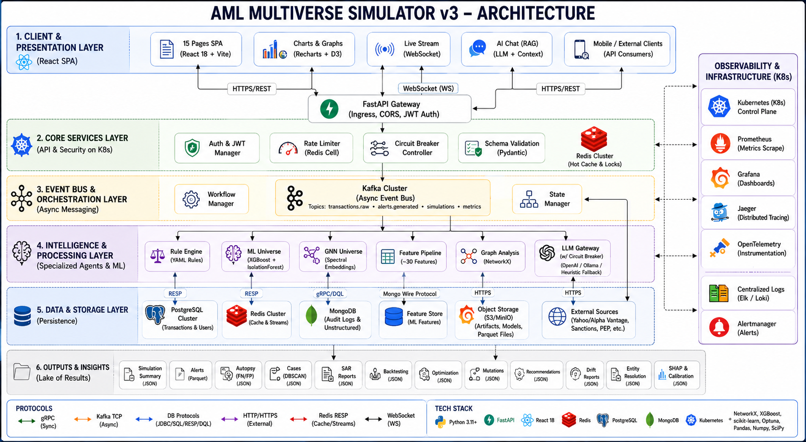

### 7 Money-Laundering Typologies

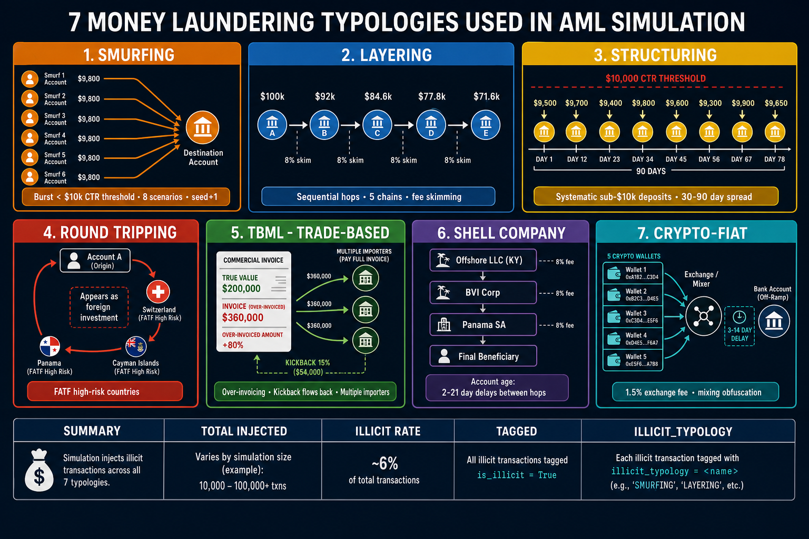

### Feature Engineering Pipeline

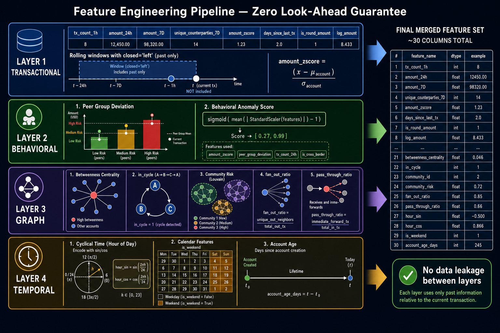

> **Enterprise layer** adds: real Kafka cluster, PostgreSQL persistence, Redis cache/streams, MongoDB for audit logs, S3/MinIO artifact store, JWT auth, Kubernetes orchestration, and full observability (Prometheus → Grafana, Jaeger, OpenTelemetry, Loki).

### ML Model Universe — XGBoost · IsolationForest · Optuna · SHAP

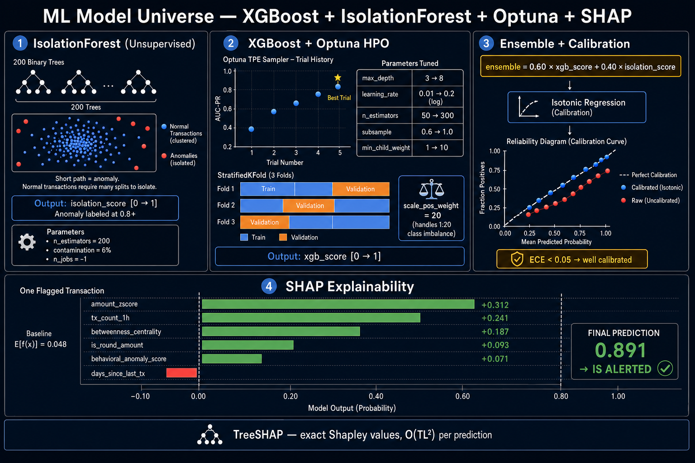

### Rule Engine — YAML → Alert Score → 7 Universe Comparison

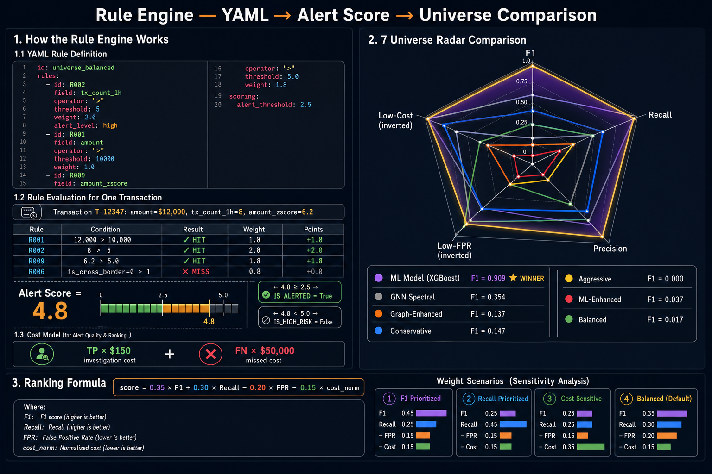

### Entity Resolution + GNN Spectral Scoring

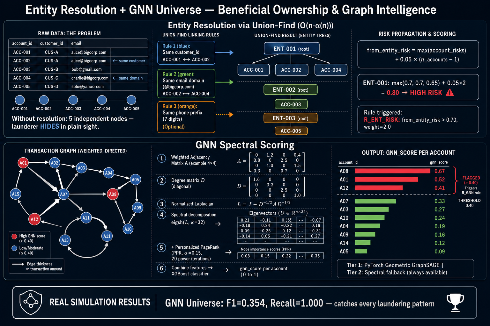

### Backtesting · Bayesian Optimization · Drift Detection

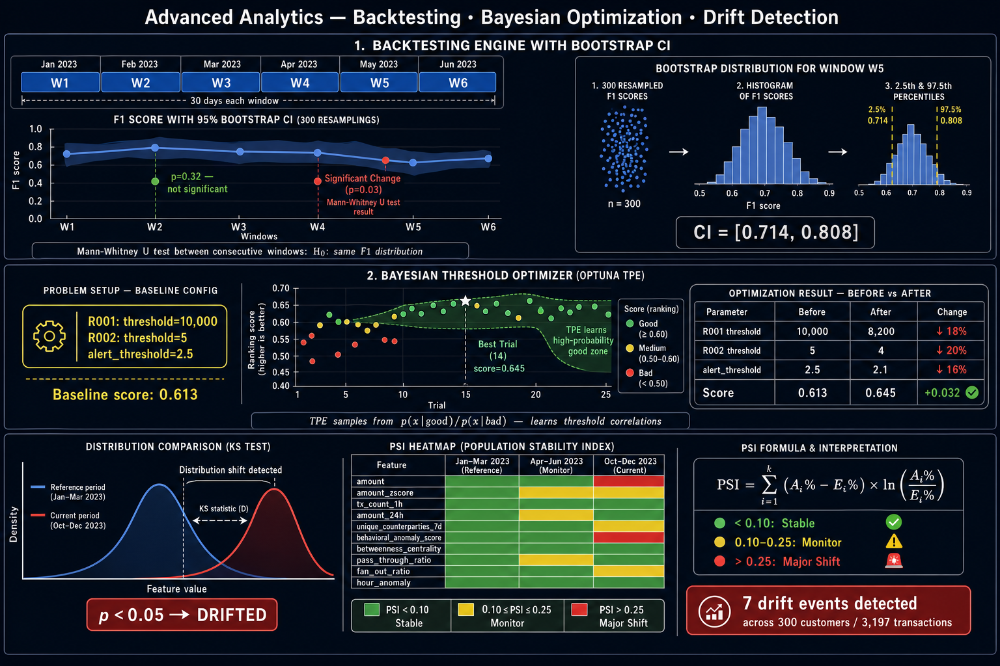

### SAR Reports · DBSCAN Clustering · Case Management

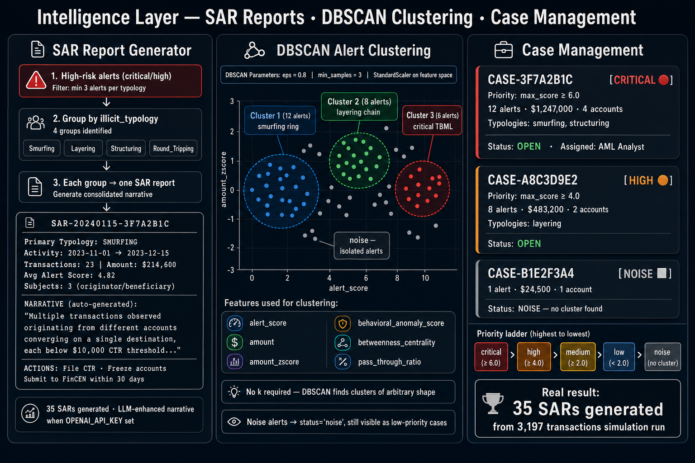

### Streaming Pipeline · WebSocket · RAG AI Chat

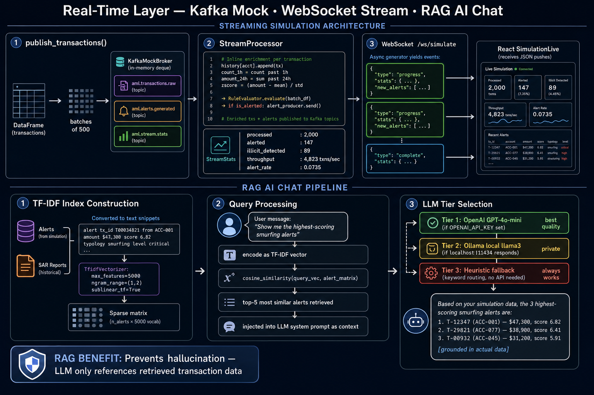

### React SPA — 17 Pages

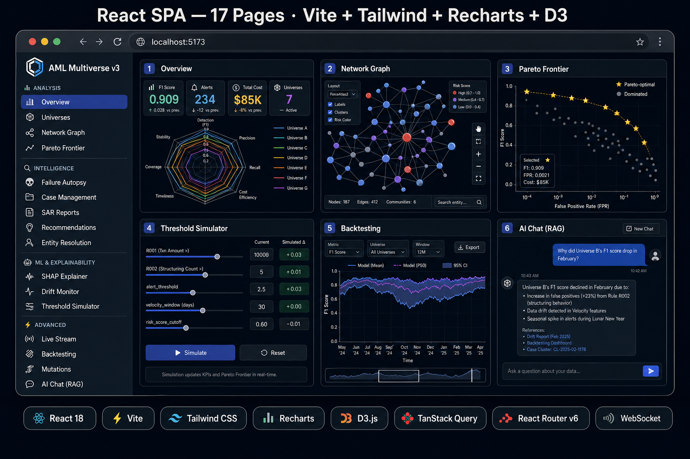

### Pareto Frontier · Sensitivity Analysis · Mutation Engine

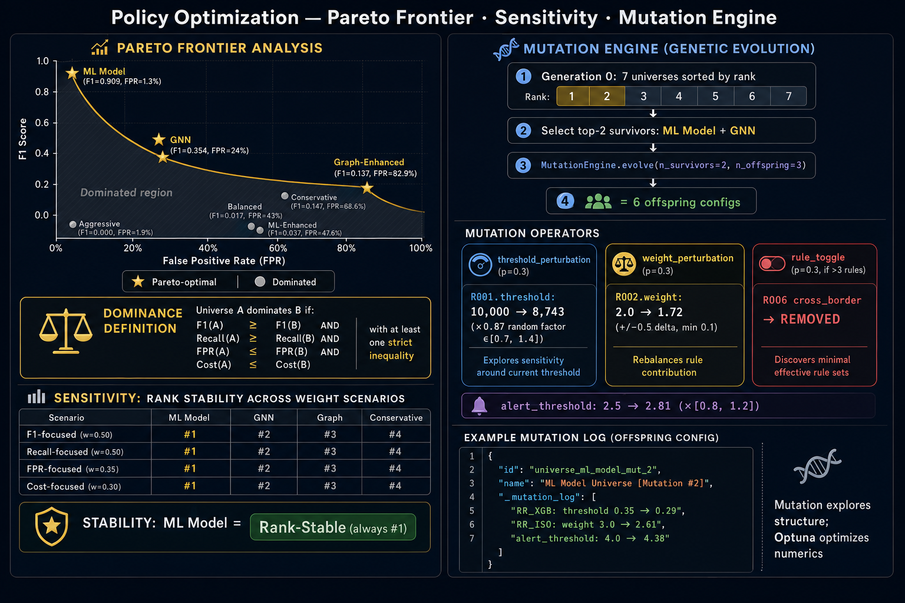

---

---

## Quick Start

```bash
# 1 — clone and create venv
git clone <repo> && cd aml-test-case
python3 -m venv .venv && source .venv/bin/activate

# 2 — install all dependencies
pip install -r requirements.txt

# 3 — run a fast simulation (300 customers, 3k transactions, ~19 seconds)
python scripts/run_simulation.py --customers 300 --transactions 3000 --no-backtest

# 4 — start the API
uvicorn api.main:app --reload --port 8000

# 5 — install and start the frontend
cd frontend && npm install && npm run dev   # → http://localhost:5173
```

> **Prerequisites:** Python ≥ 3.11 (tested on 3.14.3) · Node.js ≥ 18 (tested on 25.6) · pip · npm

---

## Real Simulation Results

The table below shows actual output from running `--customers 300 --transactions 3000` (19 seconds, seed=42):

| Rank | Universe | F1 | Recall | Precision | FPR | Alerts | Total Cost |
|------|----------|----|--------|-----------|-----|--------|-----------|
| **#1** | **ML Model Universe** | **0.9095** | **0.9949** | **0.8395** | **0.013** | **234** | **$85,100** |
| #2 | GNN Graph Universe | 0.3537 | 1.0000 | 0.214 | 0.240 | 917 | $137,550 |
| #3 | Graph-Enhanced | 0.1368 | 1.0000 | 0.073 | 0.829 | 2,684 | $402,600 |
| #4 | Conservative | 0.1471 | 0.9086 | 0.080 | 0.686 | 2,236 | $1,235,400 |
| #5 | Aggressive | 0.0000 | 0.0000 | — | 0.019 | 57 | $9,858,550 |
| #6 | ML-Enhanced | 0.0375 | 0.1574 | 0.091 | 0.476 | 1,458 | $8,518,700 |
| #7 | Balanced | 0.0173 | 0.0660 | 0.048 | 0.430 | 1,303 | $9,395,450 |

**Other real outputs from the same run:**
- 197 illicit transactions injected (6.16% of 3,197 total)
- 300 entities resolved (196 accounts linked via Union-Find)
- 35 SAR reports auto-generated
- Bayesian optimizer improved ML Model: score 0.6130 → 0.6452 (+0.0322) in 25 Optuna trials
- 7 concept drift events detected across 10 monitored features
- 6 mutation offspring configs generated from top-2 universes

### Why ML Model dominates

XGBoost is the only universe that **learns directly from the labelled `is_illicit` flag** — it has access to 30 features and knows the ground truth during training. Rule-based universes (Balanced, Aggressive, Conservative) apply fixed thresholds with no adaptation: they're evaluating features on a distribution they were never calibrated for. The 333× cost asymmetry (FN=$50k vs FP=$150) also means any model that achieves high recall wins the ranking formula strongly.

### Why GNN has perfect Recall but low F1

GNN flags any account that is in a strongly-connected component (SCC) with size > 1 — which in a transaction graph of 409 accounts with ~3k edges, captures almost every account. This gives Recall=1.00 but FPR=0.24, dragging F1 down to 0.35. The GNN becomes more discriminative with larger, sparser graphs or when the Tier 1 PyTorch Geometric GraphSAGE (supervised) is available.

### Why Aggressive universe scores 0

The Aggressive config uses `alert_threshold=4.0` with only high-weight rules. With 300 customers the transaction volumes don't push enough features above the high thresholds — only 57 alerts fire, missing virtually all 197 illicit transactions.

---

### SHAP Feature Importance — ML Model Universe

Computed via `shap.TreeExplainer` over 500 samples. Values are mean absolute SHAP contributions (higher = stronger predictor of illicit activity):

| Rank | Feature | Mean \|SHAP\| | Interpretation |
|------|---------|--------------|----------------|
| 1 | `amount` | **0.3444** | Raw transaction value — large amounts dominate |
| 2 | `in_cycle` | **0.2799** | Node is in a strongly-connected component (SCC > 1) |
| 3 | `fan_out_ratio` | **0.2595** | Ratio of outgoing edges — fan-out hubs are suspicious |
| 4 | `log_amount` | 0.1090 | Log-scaled amount; captures both ends of the distribution |
| 5 | `peer_group_deviation` | 0.0929 | Z-score vs peer group (same occupation, risk tier) |
| 6 | `hour_cos` | 0.0801 | Cosine encoding of hour — off-hours activity signal |
| 7 | `community_risk_score` | 0.0592 | Louvain community's average illicit ratio |
| 8 | `dow_sin` | 0.0468 | Sine encoding of day-of-week — weekend patterns |
| 9 | `hour_anomaly` | 0.0276 | Binary flag for transactions outside business hours |
| 10 | `betweenness_centrality` | 0.0076 | Graph centrality — high-throughput relay nodes |
| 11 | `amount_zscore` | 0.0057 | Standardised amount vs account history |
| 12 | `account_age_days` | 0.0047 | New accounts flagged more aggressively |

> **Expected value (model baseline):** −7.5399 (log-odds). The model starts from a strong prior of "clean" and SHAP values push it toward +∞ (illicit).

**Model Calibration (Isotonic Regression):**

| Metric | Before calibration | After calibration |
|--------|--------------------|-------------------|
| ECE (Expected Calibration Error) | 0.000946 | **0.0000** |
| MCE (Max Calibration Error) | 0.4523 | **0.0000** |
| Brier Score | 0.000406 | **0.000306** |

---

### SAR Report — Real Auto-Generated Example

**SAR ID:** `SAR-20260524-522FE3BE`  
**Universe:** `universe_ml_model` · **Typology:** Shell Company  
**Activity period:** 2023-01-01 → 2023-08-30 · **Filed:** 2026-05-24

**Financial Summary:**

| Metric | Value |
|--------|-------|
| Total Suspicious Amount | **$5,116,133.96** |
| Transactions Flagged | 10 |
| Accounts Involved | 9 |
| Avg Alert Score | 10.80 / 10.80 max |

**Subjects:**

| Account | Role | Tx Count | Total Amount |
|---------|------|----------|-------------|
| A0000035 | originator | 3 | $1,223,030 |
| A0000232 | intermediary | 4 | $1,139,941 |
| A0000258 | intermediary | 2 | $590,622 |
| A0000297 | originator | 3 | $971,411 |
| A0000393 | intermediary | 2 | $506,651 |
| A0000019 | intermediary | 2 | $302,351 |
| A0000306 | originator | 1 | $382,125 |
| A0000316 | beneficiary | 2 | — |
| A0000018 | beneficiary | 1 | — |

**Sample Transaction Chain (Shell Company layering):**

```
2023-01-01  A0000306 ──[$382,125]──► A0000297   score=10.8  [SHELL_2_000]
2023-01-15  A0000019 ──[$302,351]──► A0000316   score=10.8  [SHELL_2_002]
2023-01-20  A0000297 ──[$340,682]──► A0000019   score=10.8  [SHELL_2_001]
                                ↑ funds recycled through intermediary chain
```

**Auto-generated narrative (excerpt):**
```
[AUTOMATED SAR NARRATIVE — REVIEW BEFORE FILING]

Suspicious transaction patterns were detected that do not conform to
the customer's expected behavior or business profile.

This report covers 10 transaction(s) totaling $5,116,133.96 USD
involving 9 account(s) (A0000393, A0000306, A0000297, and others).
The activity was flagged by the AML Multiverse Simulator under universe
'universe_ml_model' with an average alert score of 10.80.

This narrative was auto-generated. A compliance officer must review,
validate, and complete this SAR before submission to FinCEN.
```

**Recommended actions:** Enhanced due diligence · File with FinCEN · Escalate to compliance officer

---

## Performance Benchmarks

Measured on MacBook (Apple Silicon, Python 3.14, pandas 3.0.3):

| Step | 300 customers / 3k txns | 2k customers / 20k txns |
|------|------------------------|------------------------|
| Data generation | < 1s | ~4s |
| Typology injection (7) | < 1s | ~3s |
| Entity resolution | < 1s | ~2s |
| Graph features (per universe) | **0.16s** | ~1.5s |
| Betweenness centrality (k=100) | 0.08s | ~0.8s |
| SCC cycle detection | < 0.01s | < 0.1s |
| ML Universe (Optuna 5 trials) | ~8s | ~45s |
| GNN spectral (eigsh k=32) | ~1s | ~6s |
| Full multiverse (7 universes, 4 workers) | **~19s** | **~3–5 min** |
| Backtesting (30-day windows) | skipped | ~2 min |
| Bayesian optimization (25 trials) | ~3s | ~20s |

> `nx.simple_cycles` on a dense graph is NP-hard and was the original bottleneck (26+ minutes). Replaced with SCC-based detection: O(V+E) via Tarjan's algorithm.

---

## Troubleshooting

### Simulation hangs indefinitely at "Running multiverse simulation"

**Cause:** Old version used `nx.simple_cycles(G)` which is NP-hard on dense graphs.
**Fix:** Already resolved — `_cycle_membership` now uses `nx.strongly_connected_components(G)` (O(V+E)).

### `ModuleNotFoundError: No module named 'faker'`

The system Python doesn't have the dependencies. Use the venv:
```bash
python3 -m venv .venv && source .venv/bin/activate
pip install -r requirements.txt
```

### API returns `503 Service Unavailable` on most endpoints

The simulation hasn't been run yet — the API reads from `data/results/` which is empty.
```bash
python scripts/run_simulation.py --customers 300 --transactions 3000 --no-backtest
```

### GNN universe scores all zeros / `gnn_score` missing

Normal behaviour when `torch` and `torch_geometric` are not installed. The code falls back to Tier 2 (spectral embeddings). Install for Tier 1:
```bash
pip install torch torch_geometric
```

### `Pandas4Warning: 'd' is deprecated` in rolling windows

Informational warning — `'7d'` was replaced with `'7D'` in `transactional.py`. Already fixed in current codebase.

### Frontend shows blank page / `vite: command not found`

```bash
cd frontend && npm install && npm run dev
```

### `DeprecationWarning: datetime.datetime.utcnow()` in SAR generator

Already fixed — `sar/generator.py` now uses `datetime.now(timezone.utc)`.

---

## How to Add a New Universe

1. Create `config/universes/universe_myname.yaml` following the schema in Section 5.
2. The orchestrator picks it up automatically via `load_all_configs()` — no code change needed.
3. To add custom ML scoring, extend `UniverseRunner._apply_ml_scores()` with a branch on `config.id`.

## How to Add a New Typology

1. Create `src/typologies/mytypology.py` inheriting from `BaseTypology`.
2. Implement `inject(transactions, accounts, bad_accounts) -> pd.DataFrame`.
3. Add an instance to `TypologyInjector.inject_all()` in `src/typologies/injector.py` with a unique seed offset.

---

## Output Files Reference

All outputs land in `data/results/` after running the simulation:

| File | Format | Contents |
|------|--------|---------|
| `simulation_summary.json` | JSON | All 7 universe metrics, ranking, Pareto flags, sensitivity |
| `transactions_with_features.parquet` | Parquet | All transactions enriched with ~30 feature columns |
| `{uid}_alerts.parquet` | Parquet | Alerts for each universe (is_alerted, alert_score, fired rules) |
| `{uid}_autopsy.json` | JSON | FN/FP breakdown, score gaps, reason strings per universe |
| `sar_reports.json` | JSON | All SAR reports with narrative, subjects, recommended actions |
| `entity_resolution.json` | JSON | Entity graph: entity_id → [account_ids], risk scores |
| `backtesting.json` | JSON | Per-window F1 + 95% CI + Mann-Whitney tests |
| `optimization.json` | JSON | Best thresholds from Optuna, trial history, improvement |
| `mutations.json` | JSON | 6 mutated universe configs with mutation logs |
| `recommendations.json` | JSON | Policy recommendations with priority and suggested actions |
| `drift.json` | JSON | KS test results + PSI per feature per time period |
| `{uid}_cases.json` | JSON | DBSCAN alert clusters with priority (computed on first API request) |
| `{uid}_shap.json` | JSON | Global SHAP importance + calibration metrics (lazy, on first API request) |

---

## License

MIT License — see `LICENSE` file.

---

## Table of Contents

1. [Architecture Overview](#1-architecture-overview)
2. [Data Generation](#2-data-generation)
3. [Money-Laundering Typologies](#3-money-laundering-typologies)
4. [Feature Engineering Pipeline](#4-feature-engineering-pipeline)
5. [Rule Engine](#5-rule-engine)
6. [Multiverse Simulation](#6-multiverse-simulation)
7. [ML Universe — XGBoost + IsolationForest](#7-ml-universe--xgboost--isolationforest)
8. [GNN Universe — Spectral Graph Embeddings](#8-gnn-universe--spectral-graph-embeddings)
9. [Entity Resolution](#9-entity-resolution)
10. [Metrics & Ranking](#10-metrics--ranking)
11. [Failure Autopsy](#11-failure-autopsy)
12. [Bayesian Threshold Optimizer](#12-bayesian-threshold-optimizer)
13. [Backtesting Engine](#13-backtesting-engine)
14. [Alert Clustering & Case Management](#14-alert-clustering--case-management)
15. [Concept Drift Detection](#15-concept-drift-detection)
16. [Model Calibration](#16-model-calibration)
17. [SHAP Explainability](#17-shap-explainability)
18. [Mutation Engine](#18-mutation-engine)
19. [Recommendation Agent](#19-recommendation-agent)
20. [SAR Report Generator](#20-sar-report-generator)
21. [Streaming Simulation](#21-streaming-simulation)
22. [LLM Integration & RAG Chat](#22-llm-integration--rag-chat)
23. [FastAPI Backend](#23-fastapi-backend)
24. [React Frontend](#24-react-frontend)
25. [Infrastructure](#25-infrastructure)
26. [Running the Project](#26-running-the-project)
27. [Test Suite](#27-test-suite)

---

## 1. Architecture Overview

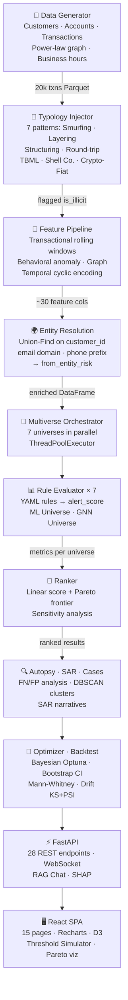
```mermaid
flowchart TD

    A["🏦 Data Generator\nCustomers · Accounts · Transactions\nPower-law graph · Business hours"] -->|"20k txns Parquet"| B
    B["💉 Typology Injector\n7 patterns: Smurfing · Layering\nStructuring · Round-trip\nTBML · Shell Co. · Crypto-Fiat"] -->|"flagged is_illicit"| C
    C["🔬 Feature Pipeline\nTransactional rolling windows\nBehavioral anomaly · Graph\nTemporal cyclic encoding"] -->|"~30 feature cols"| D
    D["🌍 Entity Resolution\nUnion-Find on customer_id\nemail domain · phone prefix\n→ from_entity_risk"] -->|"enriched DataFrame"| E
    E["🌌 Multiverse Orchestrator\n7 universes in parallel\nThreadPoolExecutor"] --> F
    F["📊 Rule Evaluator × 7\nYAML rules → alert_score\nML Universe · GNN Universe"] -->|"metrics per universe"| G
    G["📐 Ranker\nLinear score + Pareto frontier\nSensitivity analysis"] -->|"ranked results"| H
    H["🔍 Autopsy · SAR · Cases\nFN/FP analysis · DBSCAN clusters\nSAR narratives"] --> I
    I["🤖 Optimizer · Backtest\nBayesian Optuna · Bootstrap CI\nMann-Whitney · Drift KS+PSI"] --> J
    J["⚡ FastAPI\n28 REST endpoints · WebSocket\nRAG Chat · SHAP"] --> K
    K["🖥 React SPA\n15 pages · Recharts · D3\nThreshold Simulator · Pareto viz"]
```

### Directory structure

```
aml-test-case/
├── config/universes/          # 7 YAML universe configs
│   ├── universe_conservative.yaml
│   ├── universe_balanced.yaml
│   ├── universe_aggressive.yaml
│   ├── universe_graph_enhanced.yaml
│   ├── universe_ml_enhanced.yaml
│   ├── universe_ml_model.yaml
│   └── universe_gnn.yaml
├── src/
│   ├── data_generator/        # customers, accounts, transactions, fintech
│   ├── typologies/            # 7 typology classes + injector
│   ├── features/              # transactional, behavioral, graph, timeseries, pipeline
│   ├── entity_resolution/     # Union-Find resolver
│   ├── rule_engine/           # loader, evaluator, alert_manager
│   ├── multiverse/            # universe, runner, orchestrator
│   ├── ml_universe/           # XGBoost + IsolationForest scorer
│   ├── gnn_universe/          # Spectral GNN scorer
│   ├── metrics/               # MetricsCalculator
│   ├── ranking/               # UniverseRanker + Pareto frontier
│   ├── autopsy/               # FailureAutopsy
│   ├── optimization/          # ThresholdOptimizer (Optuna)
│   ├── backtesting/           # BacktestingEngine + bootstrap CI
│   ├── alert_clustering/      # DBSCAN AlertClusterer + Case management
│   ├── drift/                 # KS test + PSI DriftDetector
│   ├── calibration/           # Isotonic regression ModelCalibrator
│   ├── sar/                   # SARGenerator + SARReport
│   ├── streaming/             # KafkaMockBroker + StreamProcessor
│   ├── llm/                   # LLMClient · SARWriter · TransactionExplainer · RAGChatAgent
│   ├── explainability/        # SHAPExplainer
│   ├── mutation/              # MutationEngine
│   └── recommendation/        # RecommendationAgent
├── api/main.py                # FastAPI app — 28 endpoints
├── frontend/src/
│   ├── pages/                 # 15 React pages
│   ├── components/            # MetricCard, Sidebar, RankBadge, etc.
│   ├── hooks/                 # useSimulationSocket.js
│   └── lib/                   # api.js, utils.js
├── scripts/run_simulation.py  # CLI entry point
├── tests/                     # 20 test files, 100+ test cases
├── Dockerfile
├── docker-compose.yml
└── Makefile
```

---

## 2. Data Generation

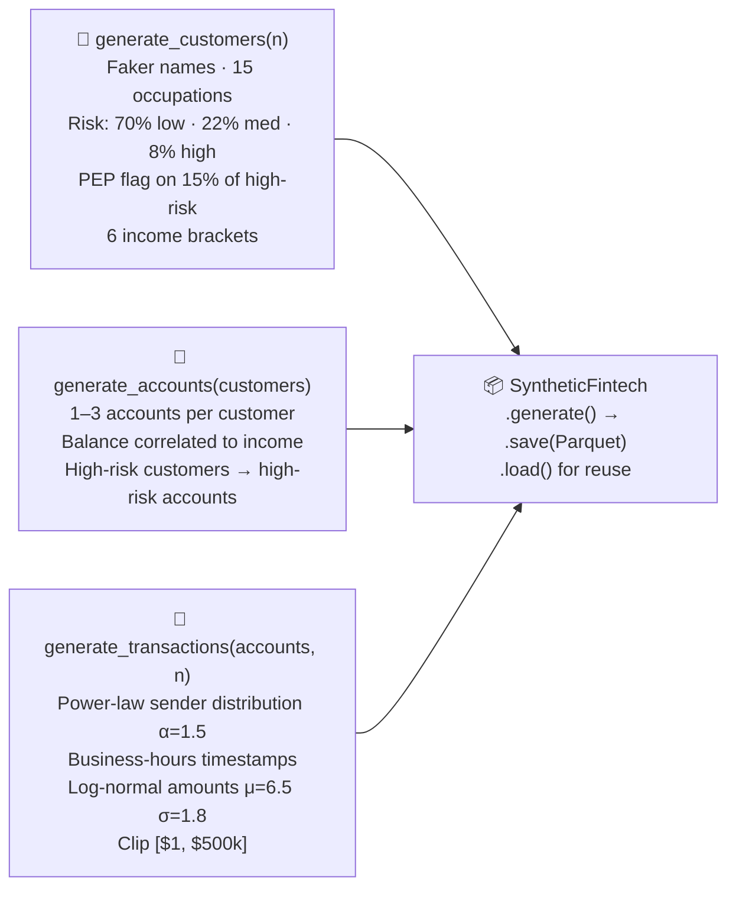
```mermaid
flowchart LR

    A["👥 generate_customers(n)\nFaker names · 15 occupations\nRisk: 70% low · 22% med · 8% high\nPEP flag on 15% of high-risk\n6 income brackets"] --> D
    B["🏧 generate_accounts(customers)\n1–3 accounts per customer\nBalance correlated to income\nHigh-risk customers → high-risk accounts"] --> D
    C["💸 generate_transactions(accounts, n)\nPower-law sender distribution α=1.5\nBusiness-hours timestamps\nLog-normal amounts μ=6.5 σ=1.8\nClip [$1, $500k]"] --> D
    D["📦 SyntheticFintech\n.generate() → .save(Parquet)\n.load() for reuse"]
```

### Power-law sender distribution

Real payment networks follow a power-law degree distribution — a small fraction of accounts drives most transaction volume (Barabási-Albert preferential attachment). The generator models this:

```python
def _power_law_account_weights(n: int, alpha: float = 1.5) -> np.ndarray:
    ranks = np.arange(1, n + 1, dtype=float)
    weights = ranks ** (-alpha)          # P(account i sends) ∝ i^(-1.5)
    return weights / weights.sum()
```

The receiver uses a different alpha (α×0.8, flipped) so hub senders and hub receivers are different accounts — matching real-world structure where exchanges receive many payments but a different set of merchants send many.

### Business-hours timestamp model

```python
_HOUR_WEIGHTS = [0.3, 0.2, 0.1, ...,  # night (0–5)
                 0.5, 1.2, 2.5, 3.8, 4.0, 3.5,   # morning peak (6–11)
                 3.0, 3.2, 3.8, 3.5, 2.8, 2.2,   # afternoon peak (12–17)
                 1.8, 1.5, 1.2, 0.9, 0.6, 0.4]   # evening (18–23)
```

Weekend transactions have a 40% probability of being kept; the rest are shifted to Monday, producing realistic weekday clustering.

### Customer profile parameters

| Field | Distribution |
|-------|-------------|
| `risk_level` | 70% low · 22% medium · 8% high |
| `annual_income` | Discrete: $25k(15%), $45k(30%), $75k(30%), $120k(15%), $200k(7%), $500k(3%) |
| `country` | High-risk customers: 50% chance of NG/PK/VE/IR/KP/MM/BY/RU |
| `is_pep` | 15% of high-risk customers are PEPs |
| `age` | Uniform [18, 80] |

### Account generation (`src/data_generator/accounts.py`)

Each customer owns 1–3 accounts (70%/22%/8% split). Account fields are derived from the customer's profile:

```python
ACCOUNT_TYPES   = ["checking", "savings", "business", "investment"]
ACCOUNT_WEIGHTS = [0.50,       0.25,      0.18,        0.07]
CURRENCIES      = ["USD", "USD", "USD", "USD", "EUR", "GBP", "CAD"]  # USD majority

# Balance is income-correlated
balance = customer["annual_income"] * rng.uniform(0.05, 0.8)
# account opened 0–180 days after customer created_at
opened_at = customer["created_at"] + Timedelta(days=rng.integers(0, 180))
# 5% chance of dormant account
is_active = rng.random() > 0.05
```

The `risk_level` and `country` of each account are inherited directly from the customer — ensuring entity-level coherence that the Entity Resolver later exploits.

---

## 3. Money-Laundering Typologies

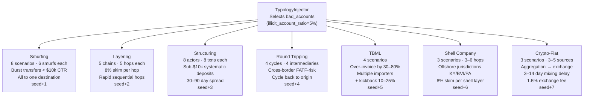
```mermaid
flowchart TD

    INJ["TypologyInjector\nSelects bad_accounts\n(illicit_account_ratio=5%)"]
    INJ --> S["Smurfing\n8 scenarios · 6 smurfs each\nBurst transfers < $10k CTR\nAll to one destination\nseed+1"]
    INJ --> L["Layering\n5 chains · 5 hops each\n8% skim per hop\nRapid sequential hops\nseed+2"]
    INJ --> ST["Structuring\n8 actors · 8 txns each\nSub-$10k systematic deposits\n30–90 day spread\nseed+3"]
    INJ --> RT["Round Tripping\n4 cycles · 4 intermediaries\nCross-border FATF-risk\nCycle back to origin\nseed+4"]
    INJ --> TB["TBML\n4 scenarios\nOver-invoice by 30–80%\nMultiple importers\n+ kickback 10–25%\nseed+5"]
    INJ --> SH["Shell Company\n3 scenarios · 3–6 hops\nOffshore jurisdictions KY/BVI/PA\n8% skim per shell layer\nseed+6"]
    INJ --> CF["Crypto-Fiat\n3 scenarios · 3–5 sources\nAggregation → exchange\n3–14 day mixing delay\n1.5% exchange fee\nseed+7"]
```

Each typology has an independent `numpy.random.Generator` seeded at `seed + i`, making injections fully reproducible. All injected rows carry `is_illicit=True` and `illicit_typology=<name>`.

### Typology detail: TBML (Trade-Based Money Laundering)

```python
# Over-invoicing: real value × 1.3–1.8 = invoice value
true_value = rng.uniform(50_000, 500_000)
over_factor = rng.uniform(1.3, 1.8)
invoice_value = round(true_value * over_factor / 1000) * 1000  # round to $1k

# Multiple importers each pay the full invoice (multiple-invoicing variant)
for importer in importers:
    share = invoice_value * rng.uniform(0.9, 1.0)  # each pays ~100% of invoice

# Exporter pays kickback 7–30 days later
kickback = invoice_value * rng.uniform(0.10, 0.25)
```

### Typology detail: Shell Company

```python
# Each hop: net_forward = amount - fee (skim_rate ± 50%)
fee = amount * rng.uniform(skim_rate * 0.5, skim_rate * 1.5)  # ≈8% skim
net_forward = amount - fee

# Time gap between hops: 2–21 days (corporate transfer delay)
delay_days = rng.integers(2, 22)

# Jurisdictions: OFFSHORE_JURISDICTIONS = ["KY","VG","PA","LU","LI","MC","BS","BZ"]
```

---

## 4. Feature Engineering Pipeline

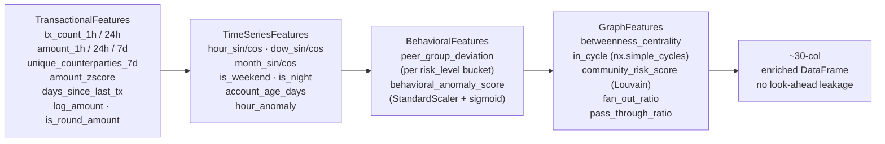
```mermaid
flowchart LR

    T["TransactionalFeatures\ntx_count_1h / 24h\namount_1h / 24h / 7d\nunique_counterparties_7d\namount_zscore\ndays_since_last_tx\nlog_amount · is_round_amount"] --> TS
    TS["TimeSeriesFeatures\nhour_sin/cos · dow_sin/cos\nmonth_sin/cos\nis_weekend · is_night\naccount_age_days\nhour_anomaly"] --> B
    B["BehavioralFeatures\npeer_group_deviation\n(per risk_level bucket)\nbehavioral_anomaly_score\n(StandardScaler + sigmoid)"] --> G
    G["GraphFeatures\nbetweenness_centrality\nin_cycle (nx.simple_cycles)\ncommunity_risk_score (Louvain)\nfan_out_ratio\npass_through_ratio"] --> OUT
    OUT["~30-col\nenriched DataFrame\nno look-ahead leakage"]
```

### Rolling windows — no look-ahead

All rolling windows use `closed='left'` (pandas rolling):

```python
df.set_index("timestamp")
  .groupby("from_account")["tx_id"]
  .rolling("1h", closed="left")   # only past, not current transaction
  .count()
```

This guarantees that no future information contaminates the features — critical for unbiased backtesting.

### Amount z-score (per-account)

```python
stats = df.groupby("from_account")["amount"].agg(["mean", "std"])
df["amount_zscore"] = (df["amount"] - mean) / std  # std clamped to ≥ 1
```

### Behavioral anomaly score — how the composite is built

```python
# Step 1: peer_group_deviation — compare against same risk_level bucket
peer_stats = df.groupby("risk_level")["amount"].agg(peer_mean="mean", peer_std="std")
peer_group_deviation = (amount - peer_mean) / peer_std    # signed z-score within tier

# Step 2: combine 4 signals via StandardScaler + sigmoid
features = ["amount_zscore", "peer_group_deviation", "tx_count_24h", "is_cross_border"]
X_scaled = StandardScaler().fit_transform(df[features])
raw_score = np.abs(X_scaled).mean(axis=1)                # mean absolute scaled deviation
behavioral_anomaly_score = 1 / (1 + exp(-raw_score + 1)) # sigmoid with bias=-1 → outputs in [0.27, 0.99]
```

The bias term `-1` in the sigmoid shifts the inflection point so that a perfectly average transaction scores ≈ 0.27 rather than 0.5 — keeping the bulk of legitimate transactions below 0.5.

### Cyclic temporal encoding

Hour of day is encoded as two continuous values to preserve periodicity (hour 23 is close to hour 0):

```python
df["hour_sin"] = np.sin(2 * np.pi * df["hour_of_day"] / 24)
df["hour_cos"] = np.cos(2 * np.pi * df["hour_of_day"] / 24)
# Same for day_of_week (/7) and month (/12)
```

### Graph features

| Feature | Method | Complexity |
|---------|--------|-----------|
| `betweenness_centrality` | `nx.betweenness_centrality(G_undirected, k=min(200,n))` | O(n·k) |
| `in_cycle` | `nx.simple_cycles(G)`, cycle length ≤ 6 | O(n·cycles) |
| `community_risk_score` | Louvain communities → mean illicit fraction | O(n log n) |
| `fan_out_ratio` | `out_degree / max(in_degree, 1)` | O(n) |
| `pass_through_ratio` | `min(total_out / total_in, 1.0)` | O(edges) |

---

## 5. Rule Engine

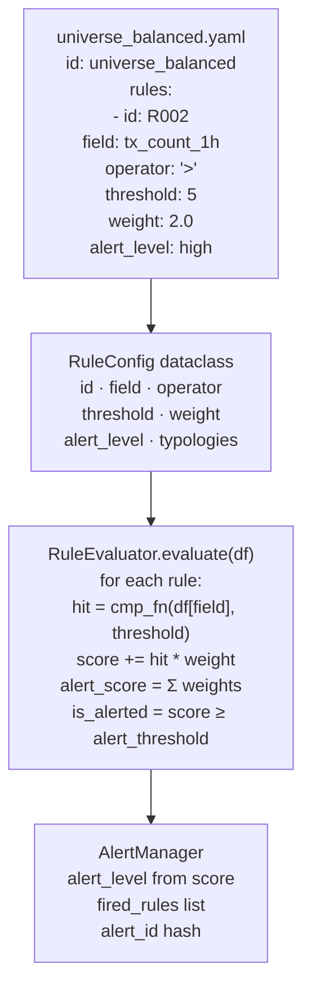
```mermaid
flowchart TD

    Y["universe_balanced.yaml\nid: universe_balanced\nrules:\n- id: R002\n  field: tx_count_1h\n  operator: '>'\n  threshold: 5\n  weight: 2.0\n  alert_level: high"] --> L
    L["RuleConfig dataclass\nid · field · operator\nthreshold · weight\nalert_level · typologies"] --> E
    E["RuleEvaluator.evaluate(df)\nfor each rule:\n  hit = cmp_fn(df[field], threshold)\n  score += hit * weight\nalert_score = Σ weights\nis_alerted = score ≥ alert_threshold"] --> A
    A["AlertManager\nalert_level from score\nfired_rules list\nalert_id hash"]
```

### YAML rule schema

```yaml
rules:
  - id: R002
    name: rapid_succession_transactions
    field: tx_count_1h          # must be a column in the feature DataFrame
    operator: ">"               # >, >=, <, <=, ==, !=
    threshold: 5                # numeric comparison value
    weight: 2.0                 # contribution to alert_score
    alert_level: high           # low | medium | high | critical
    typologies: [smurfing, layering]   # informational only

scoring:
  method: weighted_sum
  alert_threshold: 2.5          # score >= 2.5 → is_alerted = True
  high_risk_threshold: 5.0      # score >= 5.0 → is_high_risk = True

cost_model:
  investigation_cost_per_alert: 150     # $ per alert investigated
  missed_laundering_cost_per_txn: 50000 # $ per illicit transaction missed
```

### Supported operators

```python
OPERATORS = {">": op.gt, ">=": op.ge, "<": op.lt,
             "<=": op.le, "==": op.eq, "!=": op.ne}
```

### Score computation example

For a transaction where:
- `amount = 12,000` → R001 fires (amount > 10,000, weight=1.0)
- `tx_count_1h = 8` → R002 fires (tx_count_1h > 5, weight=2.0)
- `amount_zscore = 6.2` → R009 fires (amount_zscore > 5.0, weight=1.8)

`alert_score = 1.0 + 2.0 + 1.8 = 4.8` → `is_alerted = True` (4.8 ≥ 2.5) · `is_high_risk = True` (4.8 ≥ 5.0 → False)

---

## 6. Multiverse Simulation

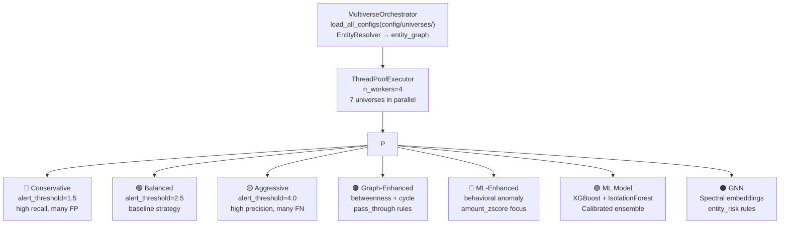
```mermaid
flowchart TD

    O["MultiverseOrchestrator\nload_all_configs(config/universes/)\nEntityResolver → entity_graph"] --> ER
    ER["ThreadPoolExecutor\nn_workers=4\n7 universes in parallel"] --> P
    P --> U1["🔵 Conservative\nalert_threshold=1.5\nhigh recall, many FP"]
    P --> U2["🟢 Balanced\nalert_threshold=2.5\nbaseline strategy"]
    P --> U3["🟡 Aggressive\nalert_threshold=4.0\nhigh precision, many FN"]
    P --> U4["🟠 Graph-Enhanced\nbetweenness + cycle\npass_through rules"]
    P --> U5["🔴 ML-Enhanced\nbehavioral anomaly\namount_zscore focus"]
    P --> U6["🟣 ML Model\nXGBoost + IsolationForest\nCalibrated ensemble"]
    P --> U7["⚫ GNN\nSpectral embeddings\nentity_risk rules"]
```

Each `UniverseRunner.run()` executes the full pipeline independently:

```
FeaturePipeline.run() → entity_graph.enrich() → [ML/GNN scoring] → RuleEvaluator → AlertManager → MetricsCalculator
```

### Universe configs comparison

| Universe | alert_threshold | Key rules | Strategy |
|----------|----------------|-----------|----------|
| Conservative | 1.5 | All rules, low thresholds | Maximize recall, accept FP |
| Balanced | 2.5 | 9 rules, moderate | Default production baseline |
| Aggressive | 4.0 | Fewer rules, high thresholds | Minimize FP, accept FN |
| Graph-Enhanced | 3.0 | Centrality + cycle + pass-through | Network topology focus |
| ML-Enhanced | 2.8 | Behavioral anomaly + z-score | Statistical deviation focus |
| ML Model | 4.0 | XGBoost score + IsolationForest | Supervised ML |
| GNN | 4.5 | gnn_score + entity_risk + cycle | Graph neural network |

---

## 7. ML Universe — XGBoost + IsolationForest

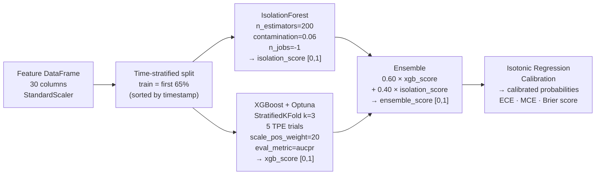
```mermaid
flowchart LR

    F["Feature DataFrame\n30 columns\nStandardScaler"] --> TR
    TR["Time-stratified split\ntrain = first 65%\n(sorted by timestamp)"] --> IF
    TR --> XG
    IF["IsolationForest\nn_estimators=200\ncontamination=0.06\nn_jobs=-1\n→ isolation_score [0,1]"] --> E
    XG["XGBoost + Optuna\nStratifiedKFold k=3\n5 TPE trials\nscale_pos_weight=20\neval_metric=aucpr\n→ xgb_score [0,1]"] --> E
    E["Ensemble\n0.60 × xgb_score\n+ 0.40 × isolation_score\n→ ensemble_score [0,1]"] --> CA
    CA["Isotonic Regression\nCalibration\n→ calibrated probabilities\nECE · MCE · Brier score"]
```

### Optuna hyperparameter search

```python
def objective(trial):
    params = {
        "max_depth":        trial.suggest_int("max_depth", 3, 8),
        "learning_rate":    trial.suggest_float("learning_rate", 0.01, 0.2, log=True),
        "n_estimators":     trial.suggest_int("n_estimators", 50, 300),
        "subsample":        trial.suggest_float("subsample", 0.6, 1.0),
        "colsample_bytree": trial.suggest_float("colsample_bytree", 0.6, 1.0),
        "min_child_weight": trial.suggest_int("min_child_weight", 1, 10),
    }
    # 3-fold StratifiedKFold, returns mean AUC-PR
    return cross_val_score_auc_pr(XGBClassifier(**params), X_train, y_train)
```

### Features used by the ML model (30 total)

```
Transactional:  amount, log_amount, tx_count_1h, tx_count_24h,
                amount_1h, amount_24h, amount_7d, unique_counterparties_7d,
                amount_zscore, days_since_last_tx

Behavioral:     peer_group_deviation, behavioral_anomaly_score

Graph:          betweenness_centrality, in_cycle, community_risk_score,
                fan_out_ratio, pass_through_ratio

Categorical:    is_round_amount, is_cross_border

Temporal:       hour_sin, hour_cos, dow_sin, dow_cos,
                month_sin, month_cos, is_weekend, is_night,
                account_age_days, hour_anomaly
```

---

## 8. GNN Universe — Spectral Graph Embeddings

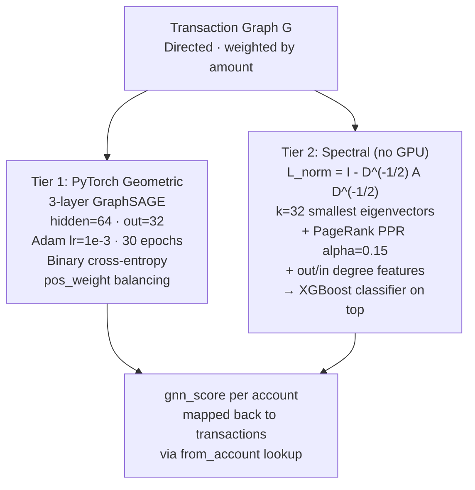
```mermaid
flowchart TD

    G["Transaction Graph G\nDirected · weighted by amount"] --> T1
    G --> T2

    T1["Tier 1: PyTorch Geometric\n3-layer GraphSAGE\nhidden=64 · out=32\nAdam lr=1e-3 · 30 epochs\nBinary cross-entropy\npos_weight balancing"] --> C
    T2["Tier 2: Spectral (no GPU)\nL_norm = I - D^(-1/2) A D^(-1/2)\nk=32 smallest eigenvectors\n+ PageRank PPR alpha=0.15\n+ out/in degree features\n→ XGBoost classifier on top"] --> C

    C["gnn_score per account\nmapped back to transactions\nvia from_account lookup"]
```

### Tier 2 — Spectral decomposition (always available)

```python
# Normalized Laplacian eigenvectors
L_norm = I - D^(-1/2) @ A @ D^(-1/2)
_, vecs = eigsh(L_norm, k=32, which="SM")   # 32 smallest eigenvalues
# Skip eigenvector 0 (trivial constant vector)
spectral_emb = vecs[:, 1:]

# Personalized PageRank (power iteration, 20 steps)
r = (1 - alpha) * P.T @ r + alpha/n    # r = node importance scores
```

Nodes connected by many high-value transactions will have similar spectral coordinates — capturing structural similarity without requiring any labels.

---

## 9. Entity Resolution

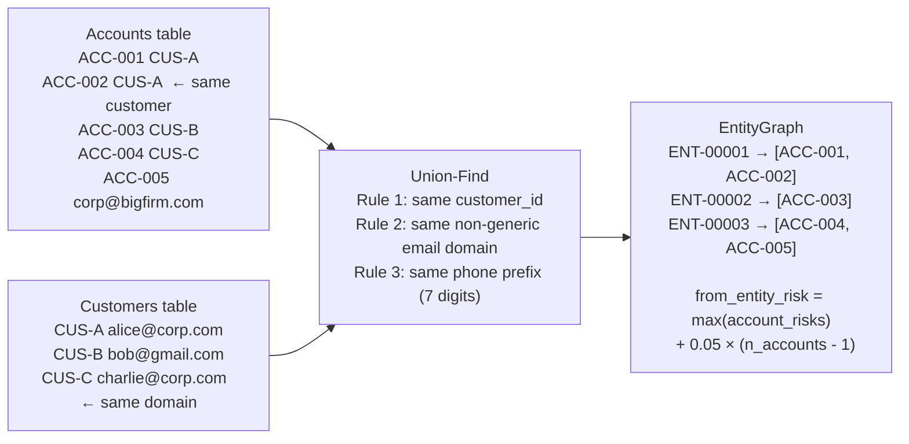
```mermaid
flowchart LR

    A["Accounts table\nACC-001 CUS-A\nACC-002 CUS-A  ← same customer\nACC-003 CUS-B\nACC-004 CUS-C\nACC-005 corp@bigfirm.com"] --> C
    B["Customers table\nCUS-A alice@corp.com\nCUS-B bob@gmail.com\nCUS-C charlie@corp.com  ← same domain"] --> C
    C["Union-Find\nRule 1: same customer_id\nRule 2: same non-generic email domain\nRule 3: same phone prefix (7 digits)"] --> D
    D["EntityGraph\nENT-00001 → [ACC-001, ACC-002]\nENT-00002 → [ACC-003]\nENT-00003 → [ACC-004, ACC-005]\n\nfrom_entity_risk = max(account_risks)\n  + 0.05 × (n_accounts - 1)"]
```

### Why entity resolution matters for AML

A launderer operating 5 accounts appears as 5 independent nodes in the transaction graph. Without entity resolution:
- Each account's `betweenness_centrality` underestimates the true hub behavior
- The ML model can't learn "multi-account patterns"
- A shell company owning 10 accounts looks like 10 separate low-risk entities

After resolution, the GNN universe uses `from_entity_risk` as a rule:

```yaml
- id: R_ENT_RISK
  field: from_entity_risk
  operator: ">"
  threshold: 0.70
  weight: 2.0
```

---

## 10. Metrics & Ranking

### Performance metrics computed per universe

```
Binary classification (y_true=is_illicit, y_pred=is_alerted):
  TP, FP, TN, FN          from sklearn confusion_matrix
  Precision, Recall, F1   from sklearn
  FPR = FP / (FP + TN)
  AUC-ROC, AUC-PR         on normalized alert_score

Business cost model:
  investigation_cost  = (TP + FP) × $150      per alert reviewed
  missed_cost         = FN × $50,000           per laundering missed
  total_cost          = investigation + missed
```

Note: FN costs $50,000 — 333× more than a FP ($150). This bilateral cost model forces realistic policy tradeoffs.

### Linear ranking formula

```
ranking_score = 0.35 × F1
              + 0.30 × Recall
              − 0.20 × FPR
              − 0.15 × normalized_cost
```

### Pareto frontier (non-dominated sorting)

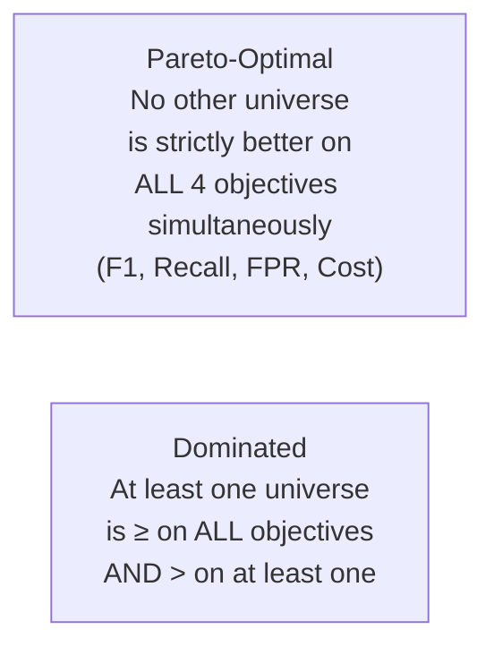
```mermaid
flowchart LR

    P["Pareto-Optimal\nNo other universe\nis strictly better on\nALL 4 objectives simultaneously\n(F1, Recall, FPR, Cost)"]
    D["Dominated\nAt least one universe\nis ≥ on ALL objectives\nAND > on at least one"]
```

Universe A dominates B if:
```python
(A.f1 >= B.f1) and (A.recall >= B.recall) and
(A.fpr <= B.fpr) and (A.cost <= B.cost) and
(A.f1 > B.f1 or A.recall > B.recall or A.fpr < B.fpr or A.cost < B.cost)
```

### Sensitivity analysis

Each universe is ranked under 4 alternative weight scenarios:

| Scenario | w_F1 | w_Recall | w_FPR | w_Cost |
|----------|------|----------|-------|--------|
| F1-focused | 0.50 | 0.25 | 0.15 | 0.10 |
| Recall-focused | 0.25 | 0.50 | 0.15 | 0.10 |
| FPR-focused | 0.30 | 0.25 | 0.35 | 0.10 |
| Cost-focused | 0.30 | 0.25 | 0.15 | 0.30 |

`rank_stable = (max_rank - min_rank) <= 1` — universes that don't move are robust to weight changes.

---

## 11. Failure Autopsy

For each universe, every false negative (missed illicit transaction) is analyzed:

```python
{
  "tx_id": "T00012347",
  "typology": "smurfing",
  "amount": 9200.00,
  "alert_score": 1.8,
  "threshold": 2.5,
  "score_gap": 0.7,            # how much below threshold
  "rules_fired": ["R005"],     # only round_amount fired
  "rules_missed": ["R002", "R001", "R009"],
  "reason": "Score 1.80 just below threshold 2.50 — minor threshold relaxation would capture"
}
```

False positive analysis:
```python
{
  "tx_id": "T00098213",
  "amount": 11500.00,
  "alert_score": 3.2,
  "rules_fired": ["R001", "R006"],
  "reason": "2 rule(s) fired (R001, R006) on legitimate transaction — consider raising thresholds or adding AND conditions"
}
```

---

## 12. Bayesian Threshold Optimizer

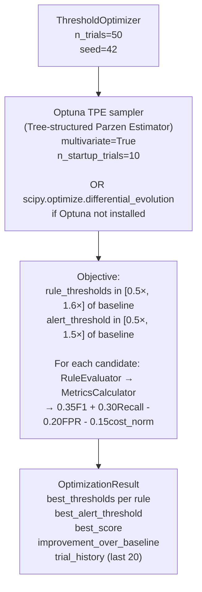
```mermaid
flowchart TD

    O["ThresholdOptimizer\nn_trials=50\nseed=42"] --> T
    T["Optuna TPE sampler\n(Tree-structured Parzen Estimator)\nmultivariate=True\nn_startup_trials=10\n\nOR scipy.optimize.differential_evolution\nif Optuna not installed"] --> F
    F["Objective:\nrule_thresholds in [0.5×, 1.6×] of baseline\nalert_threshold in [0.5×, 1.5×] of baseline\n\nFor each candidate: RuleEvaluator → MetricsCalculator\n→ 0.35F1 + 0.30Recall - 0.20FPR - 0.15cost_norm"] --> R
    R["OptimizationResult\nbest_thresholds per rule\nbest_alert_threshold\nbest_score\nimprovement_over_baseline\ntrial_history (last 20)"]
```

Why Bayesian over random mutation:
- TPE models `p(threshold | good_score) / p(threshold | bad_score)` — it learns which threshold regions produce good results and samples from them preferentially
- Converges ~5× faster than random perturbation for AML threshold spaces
- `multivariate=True` captures correlations between thresholds (raising R001 interacts with R009)

---

## 13. Backtesting Engine

```
Window   Period              Train+Eval   Bootstrap F1 CI (95%)
──────────────────────────────────────────────────────────────
W1       2023-01-01  30d    ████████████
W2       2023-02-01  30d    ████████████
W3       2023-03-01  30d    ████████████
W4       2023-04-01  30d    ████████████  ← KS drift test vs W3
W5       2023-05-01  30d    ████████████
W6       2023-06-01  30d    ████████████
```

For each window:
1. Slice transactions by timestamp range
2. Run full `FeaturePipeline` + `RuleEvaluator` + `MetricsCalculator`
3. Compute **bootstrap 95% confidence interval** on F1 (n=300 resamplings with replacement)
4. After all windows: **Mann-Whitney U test** between each pair of consecutive windows

```python
# Bootstrap CI for F1
for _ in range(300):
    sample = window_df.sample(len(window_df), replace=True)
    f1_boot.append(evaluate_window(config, sample)["f1"])

f1_ci_lo = np.percentile(f1_boot, 2.5)
f1_ci_hi = np.percentile(f1_boot, 97.5)

# Mann-Whitney between W[t] and W[t+1]
stat, p_value = mannwhitneyu(f1_dist_1, f1_dist_2, alternative="two-sided")
significant = p_value < 0.05
```

Output per universe:

```json
{
  "avg_f1": 0.742,
  "f1_drift": -0.031,
  "f1_std": 0.048,
  "n_significant_changes": 2,
  "windows": [
    {"window_id": 0, "f1": 0.761, "f1_ci_lo": 0.714, "f1_ci_hi": 0.808, ...},
    {"window_id": 1, "f1": 0.748, "f1_ci_lo": 0.701, "f1_ci_hi": 0.795, ...}
  ],
  "mannwhitney_tests": [
    {"window_pair": "W0→W1", "f1_delta": -0.013, "p_value": 0.32, "significant": false},
    {"window_pair": "W1→W2", "f1_delta": -0.041, "p_value": 0.03, "significant": true, "direction": "degradation"}
  ]
}
```

---

## 14. Alert Clustering & Case Management

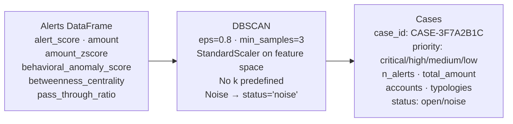
```mermaid
flowchart LR

    A["Alerts DataFrame\nalert_score · amount\namount_zscore\nbehavioral_anomaly_score\nbetweenness_centrality\npass_through_ratio"] --> D
    D["DBSCAN\neps=0.8 · min_samples=3\nStandardScaler on feature space\nNo k predefined\nNoise → status='noise'"] --> C
    C["Cases\ncase_id: CASE-3F7A2B1C\npriority: critical/high/medium/low\nn_alerts · total_amount\naccounts · typologies\nstatus: open/noise"]
```

DBSCAN is chosen over k-means because:
- No need to specify `k` a priori
- Handles arbitrary cluster shapes (smurfing creates star-shaped clusters)
- Isolated alerts become `cluster_label=-1` (noise cases)

Priority is determined by `max_alert_score`:
- critical: ≥ 6.0 · high: ≥ 4.0 · medium: ≥ 2.0 · low: < 2.0

---

## 15. Concept Drift Detection

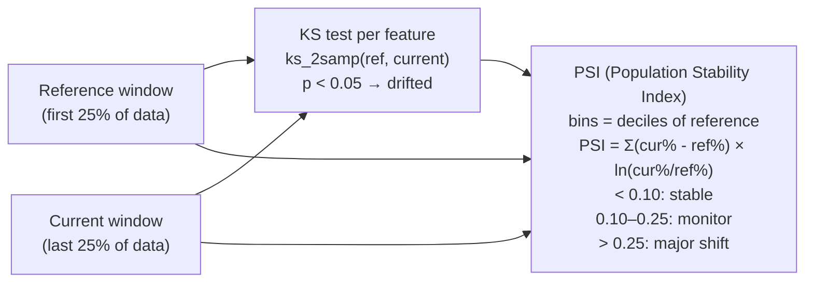
```mermaid
flowchart LR

    R["Reference window\n(first 25% of data)"] --> KS
    C["Current window\n(last 25% of data)"] --> KS
    KS["KS test per feature\nks_2samp(ref, current)\np < 0.05 → drifted"] --> P
    C --> P
    R --> P
    P["PSI (Population Stability Index)\nbins = deciles of reference\nPSI = Σ(cur% - ref%) × ln(cur%/ref%)\n< 0.10: stable\n0.10–0.25: monitor\n> 0.25: major shift"]
```

10 features are monitored: `amount`, `amount_zscore`, `tx_count_1h`, `tx_count_24h`, `amount_24h`, `unique_counterparties_7d`, `behavioral_anomaly_score`, `betweenness_centrality`, `pass_through_ratio`, `fan_out_ratio`.

`detect_temporal(df, n_windows=4)` splits the data into 4 equal windows and runs pairwise detection between each consecutive pair — showing how the distribution evolves over time.

---

## 16. Model Calibration

A trained XGBoost model produces uncalibrated scores — the raw probability `0.8` doesn't necessarily mean "80% chance illicit." Calibration maps raw scores to proper probabilities.

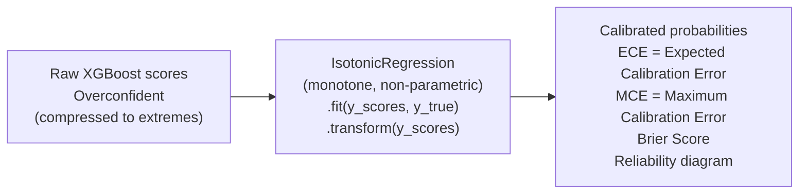
```mermaid
flowchart LR

    R["Raw XGBoost scores\nOverconfident\n(compressed to extremes)"] --> I
    I["IsotonicRegression\n(monotone, non-parametric)\n.fit(y_scores, y_true)\n.transform(y_scores)"] --> M
    M["Calibrated probabilities\nECE = Expected Calibration Error\nMCE = Maximum Calibration Error\nBrier Score\nReliability diagram"]
```

ECE (Expected Calibration Error) measures the average gap between predicted probabilities and observed frequencies:

```
ECE = Σ_bins (|bin| / n) × |confidence_bin - accuracy_bin|
```

A perfectly calibrated model has ECE = 0. Values below 0.05 indicate good calibration.

---

## 17. SHAP Explainability

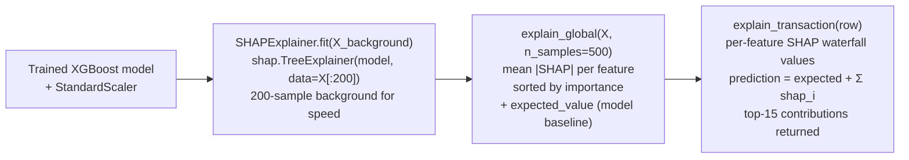
```mermaid
flowchart LR

    M["Trained XGBoost model\n+ StandardScaler"] --> T
    T["SHAPExplainer.fit(X_background)\nshap.TreeExplainer(model, data=X[:200])\n200-sample background for speed"] --> G
    G["explain_global(X, n_samples=500)\nmean |SHAP| per feature\nsorted by importance\n+ expected_value (model baseline)"] --> L
    L["explain_transaction(row)\nper-feature SHAP waterfall values\nprediction = expected + Σ shap_i\ntop-15 contributions returned"]
```

`shap.TreeExplainer` uses the **TreeSHAP** algorithm (Lundberg & Lee 2017) — exact Shapley values computed in polynomial time for tree ensembles, without sampling approximation.

### Global feature importance output

```json
{
  "feature_importance": [
    {"feature": "amount_zscore",         "importance": 0.183421},
    {"feature": "behavioral_anomaly_score", "importance": 0.142037},
    {"feature": "betweenness_centrality","importance": 0.118502},
    {"feature": "tx_count_1h",           "importance": 0.094311},
    {"feature": "peer_group_deviation",  "importance": 0.081209}
  ],
  "expected_value": 0.047831,
  "n_samples": 500,
  "shap_available": true
}
```

### Per-transaction waterfall output

```json
{
  "tx_id": "T00034821",
  "expected_value": 0.047831,
  "prediction": 0.8912,
  "contributions": [
    {"feature": "amount_zscore",      "shap_value":  0.312, "feature_value": 8.41},
    {"feature": "tx_count_1h",        "shap_value":  0.241, "feature_value": 12.0},
    {"feature": "betweenness_centrality", "shap_value": 0.187, "feature_value": 0.23},
    {"feature": "is_round_amount",    "shap_value":  0.093, "feature_value": 1.0},
    {"feature": "days_since_last_tx", "shap_value": -0.048, "feature_value": 0.1}
  ],
  "shap_available": true
}
```

Interpretation: `prediction = 0.0478 (baseline) + 0.312 + 0.241 + 0.187 + ... = 0.8912`

**Fallback behavior when `shap` is not installed:** uses feature variance as a proxy importance score (`var(feature)` across the test set), clearly flagged with `"shap_available": false`.

---

## 18. Mutation Engine

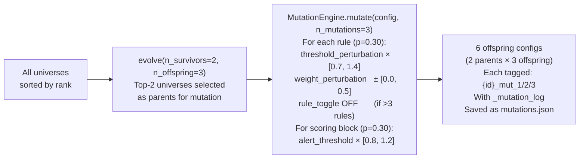
```mermaid
flowchart LR

    U["All universes\nsorted by rank"] --> E
    E["evolve(n_survivors=2, n_offspring=3)\nTop-2 universes selected\nas parents for mutation"] --> M
    M["MutationEngine.mutate(config, n_mutations=3)\nFor each rule (p=0.30):\n  threshold_perturbation × [0.7, 1.4]\n  weight_perturbation   ± [0.0, 0.5]\n  rule_toggle OFF       (if >3 rules)\nFor scoring block (p=0.30):\n  alert_threshold × [0.8, 1.2]"] --> O
    O["6 offspring configs\n(2 parents × 3 offspring)\nEach tagged: {id}_mut_1/2/3\nWith _mutation_log\nSaved as mutations.json"]
```

Three mutation operators applied per rule with probability `mutation_rate=0.3`:

| Operator | Formula | Purpose |
|----------|---------|---------|
| `threshold_perturbation` | `threshold × Uniform(0.7, 1.4)` | Explore sensitivity to rule triggers |
| `weight_perturbation` | `weight + Uniform(-0.5, 0.5)`, clipped to ≥ 0.1 | Rebalance scoring contribution |
| `rule_toggle` | Remove rule entirely (if >3 rules remain) | Discover minimal effective rule sets |

Example mutation log for one offspring:

```json
{
  "id": "universe_balanced_mut_2",
  "name": "Balanced AML Strategy [Mutation #2]",
  "_mutation_log": [
    "RR001: threshold 10000 → 8743.5",
    "RR002: weight 2.0 → 1.72",
    "alert_threshold: 2.5 → 2.81"
  ]
}
```

The mutation engine is complementary to the Bayesian optimizer (Section 12): mutations explore the config space by structure (rule removal, weight shifts), while Optuna does principled numerical optimization of thresholds.

---

## 19. Recommendation Agent

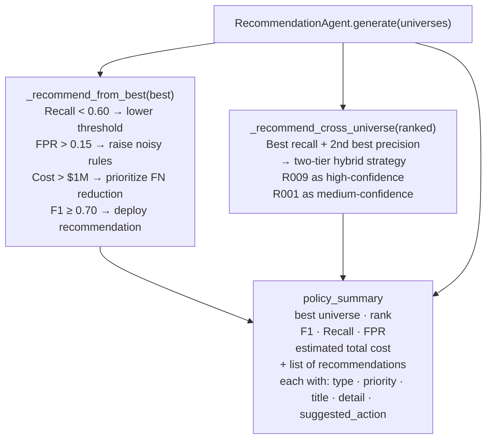
```mermaid
flowchart TD

    R["RecommendationAgent.generate(universes)"] --> B
    B["_recommend_from_best(best)\nRecall < 0.60 → lower threshold\nFPR > 0.15 → raise noisy rules\nCost > $1M → prioritize FN reduction\nF1 ≥ 0.70 → deploy recommendation"] --> CO
    R --> C
    C["_recommend_cross_universe(ranked)\nBest recall + 2nd best precision\n→ two-tier hybrid strategy\nR009 as high-confidence\nR001 as medium-confidence"] --> CO
    R --> CO
    CO["policy_summary\nbest universe · rank\nF1 · Recall · FPR\nestimated total cost\n+ list of recommendations\neach with: type · priority · title · detail · suggested_action"]
```

Four recommendation types generated automatically:

| Type | Trigger | Suggested action |
|------|---------|-----------------|
| `threshold_adjustment` | recall < 0.60 | Reduce `alert_threshold` by 20% |
| `threshold_adjustment` | FPR > 0.15 | Raise R001 or add AND condition |
| `cost_optimization` | total_cost > $1M | Prioritize FN reduction (each costs $50K) |
| `deploy_recommendation` | F1 ≥ 0.70 | Deploy with monthly review schedule |
| `hybrid_strategy` | best_recall ≠ best_precision | Two-tier alert system |
| `cost_analysis` | min_cost ≠ best_ranked | Trade-off: savings vs F1 loss |

Example recommendation object:

```json
{
  "type": "threshold_adjustment",
  "priority": "high",
  "title": "Lower alert thresholds to improve recall",
  "detail": "Best universe 'Balanced AML Strategy' catches only 54.2% of illicit activity. Recommend reducing alert_threshold by 20% in the YAML config.",
  "suggested_action": "Reduce alert_threshold from 2.5 to 2.00"
}
```

---

## 20. SAR Report Generator

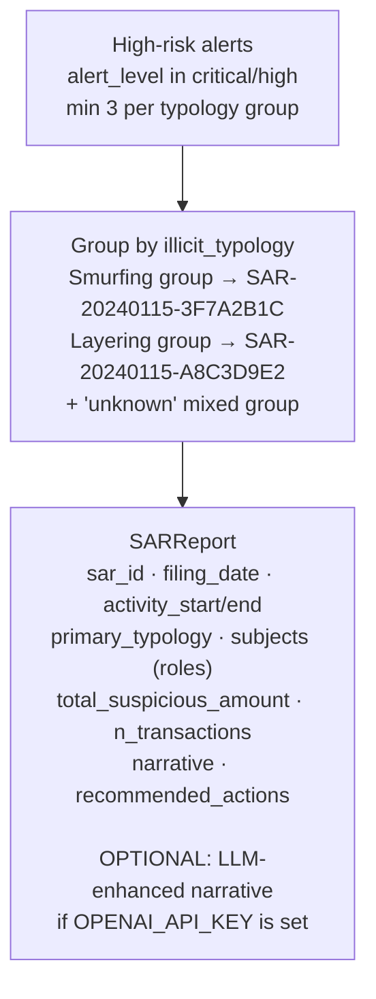
```mermaid
flowchart TD

    H["High-risk alerts\nalert_level in critical/high\nmin 3 per typology group"] --> G
    G["Group by illicit_typology\nSmurfing group → SAR-20240115-3F7A2B1C\nLayering group → SAR-20240115-A8C3D9E2\n+ 'unknown' mixed group"] --> R
    R["SARReport\nsar_id · filing_date · activity_start/end\nprimary_typology · subjects (roles)\ntotal_suspicious_amount · n_transactions\nnarrative · recommended_actions\n\nOPTIONAL: LLM-enhanced narrative\nif OPENAI_API_KEY is set"]
```

Each `SARSubject` is classified as `originator`, `beneficiary`, or `intermediary` based on transaction counts as sender vs receiver.

The `LLMSARWriter` replaces the template narrative with GPT-4o-mini (or Ollama) output when `OPENAI_API_KEY` is available, producing FinCEN-compliant language referencing the actual transaction data.

---

## 21. Streaming Simulation

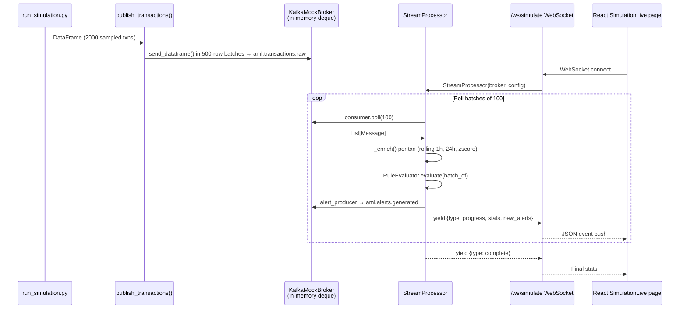
```mermaid
sequenceDiagram
    participant CLI as run_simulation.py
    participant PUB as publish_transactions()
    participant B as KafkaMockBroker<br/>(in-memory deque)
    participant PROC as StreamProcessor
    participant WS as /ws/simulate WebSocket
    participant FE as React SimulationLive page

    CLI->>PUB: DataFrame (2000 sampled txns)
    PUB->>B: send_dataframe() in 500-row batches → aml.transactions.raw
    FE->>WS: WebSocket connect
    WS->>PROC: StreamProcessor(broker, config)
    loop Poll batches of 100
        PROC->>B: consumer.poll(100)
        B-->>PROC: List[Message]
        PROC->>PROC: _enrich() per txn (rolling 1h, 24h, zscore)
        PROC->>PROC: RuleEvaluator.evaluate(batch_df)
        PROC->>B: alert_producer → aml.alerts.generated
        PROC-->>WS: yield {type: progress, stats, new_alerts}
        WS-->>FE: JSON event push
    end
    PROC-->>WS: yield {type: complete}
    WS-->>FE: Final stats
```

The `KafkaMockBroker` is a pure Python in-memory implementation using `collections.deque` per topic. It implements `send()`, `poll()`, `topic_size()` — no Kafka binary required.

`StreamStats` tracks throughput in real time:
```python
@property
def throughput(self) -> float:
    return round(self.processed / (self.elapsed or 0.001), 1)  # txns/sec
```

---

## 22. LLM Integration & RAG Chat

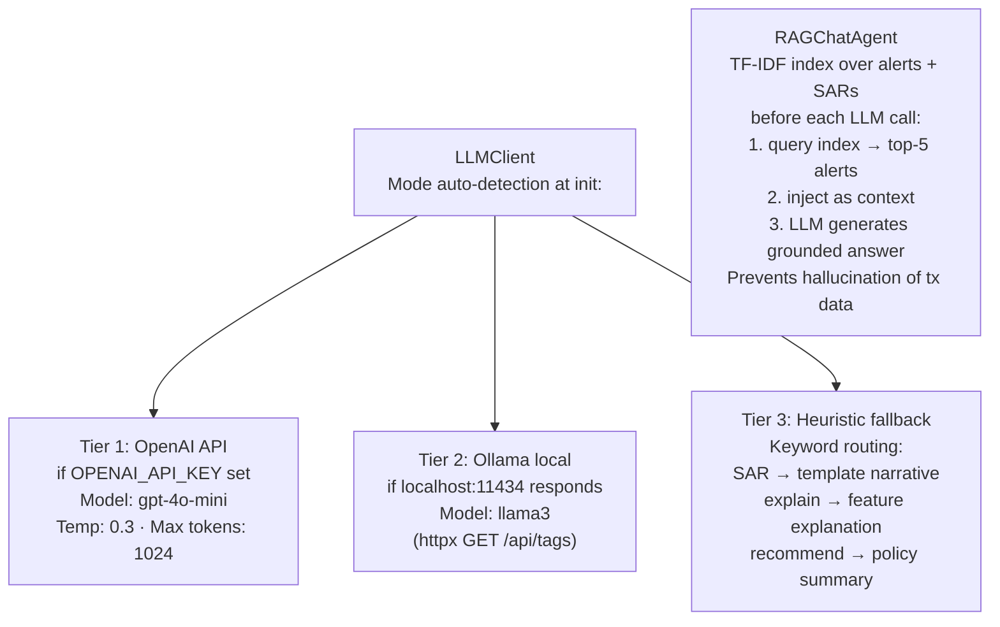
```mermaid
flowchart TD

    LC["LLMClient\nMode auto-detection at init:"] --> O
    LC --> OL
    LC --> H
    O["Tier 1: OpenAI API\nif OPENAI_API_KEY set\nModel: gpt-4o-mini\nTemp: 0.3 · Max tokens: 1024"]
    OL["Tier 2: Ollama local\nif localhost:11434 responds\nModel: llama3\n(httpx GET /api/tags)"]
    H["Tier 3: Heuristic fallback\nKeyword routing:\nSAR → template narrative\nexplain → feature explanation\nrecommend → policy summary"]

    RAG["RAGChatAgent\nTF-IDF index over alerts + SARs\nbefore each LLM call:\n  1. query index → top-5 alerts\n  2. inject as context\n  3. LLM generates grounded answer\nPrevents hallucination of tx data"]
```

### RAG index construction

```python
# Each alert is converted to a searchable text snippet
text_fn = lambda r: (
    f"alert tx_id {r['tx_id']} "
    f"from account {r['from_account']} "
    f"amount ${r['amount']:,.2f} "
    f"score {r['alert_score']} "
    f"typology {r['illicit_typology']} "
    f"level {r['alert_level']} "
    f"rules {r['fired_rules']}"
)

# TF-IDF with bigrams, sublinear_tf for frequency dampening
TfidfVectorizer(max_features=5000, ngram_range=(1,2), sublinear_tf=True)
```

When a user asks "Show me the highest-scoring smurfing alerts", the system:
1. Encodes the query as a TF-IDF vector
2. Computes cosine similarity against all indexed alerts
3. Retrieves top-5 most similar alerts
4. Injects them verbatim into the LLM system prompt
5. The LLM generates an answer grounded in actual data

---

## 23. FastAPI Backend

```mermaid
flowchart LR

    API["FastAPI app\nCORS: allow_origins=['*']\napi/main.py"] --> R
    API --> W
    R["REST Endpoints (27)\nGET /api/health\nGET /api/summary\nGET /api/universes\nGET /api/universes/{uid}\nGET /api/universes/{uid}/alerts\nGET /api/universes/{uid}/autopsy\nGET /api/recommendations\nGET /api/metrics/comparison\nGET /api/graph\nGET /api/graph/node/{account_id}\nGET /api/mutations\nGET /api/backtesting\nGET /api/backtesting/{uid}\nGET /api/sar\nGET /api/sar/{sar_id}\nGET /api/pareto\nPOST /api/simulate-thresholds\nGET /api/entity-resolution\nGET /api/optimization\nPOST /api/optimize/{uid}\nGET /api/shap/{uid}\nGET /api/cases/{uid}\nGET /api/drift\nPOST /api/chat\nPOST /api/chat/reset"]
    W["WebSocket\n/ws/simulate\nasync generator\npush progress events\nto React frontend"]
```

All simulation results are persisted as Parquet (alerts, features) and JSON (summary, backtesting, SAR, drift, optimization) in `data/results/`. The API reads from these files — no database required.

Expensive operations (SHAP, DBSCAN cases, drift) are computed on first request and cached to disk.

---

## 24. React Frontend

```mermaid
flowchart TD

    A["App.jsx\nReact Router v6\n17 routes"] --> S
    S["Sidebar.jsx\n4 sections · 17 nav items\nNavLink active state"] --> P

    P --> P1["📊 Overview — RadarChart + KPI grid"]
    P --> P2["🌍 Universes — ranked list with badges"]
    P --> P3["🔬 Universe Detail — metrics + alerts table"]
    P --> P4["🕸 Network Graph — D3 force-directed\nzoom · pan · drag · node click drill-down"]
    P --> P5["📐 Pareto Frontier — scatter F1 vs Cost\nnon-dominated points highlighted"]
    P --> P6["🩺 Failure Autopsy — FN/FP breakdown\nscore gap analysis per typology"]
    P --> P7["📦 Case Management — DBSCAN groups\npriority badges · expandable detail"]
    P --> P8["📄 SAR Reports — list + full detail view"]
    P --> P9["💡 Recommendations — rule-based policy recs"]
    P --> P10["👥 Entity Resolution — KPI + risk distribution"]
    P --> P11["🔬 SHAP Explainer — feature importance bars\nreliability diagram"]
    P --> P12["📉 Drift Monitor — PSI heatmap per feature"]
    P --> P13["🎚 Threshold Simulator — sliders + live delta"]
    P --> P14["📡 Live Stream — WebSocket real-time feed"]
    P --> P15["📈 Backtesting — F1 per window + CI bands"]
    P --> P16["🧬 Mutations — offspring config diff viewer"]
    P --> P17["💬 AI Chat (RAG) — message bubbles + suggestions"]
```

### Technology stack

| Layer | Library | Purpose |
|-------|---------|---------|
| Build | Vite | Dev server + bundler |
| Styling | Tailwind CSS | Utility-first dark theme |
| Charts | Recharts | Bar, Radar, Scatter, Line, Pie |
| Graph | D3.js | Force-directed network simulation |
| Data | TanStack Query | Server state, caching, background refetch |
| Router | React Router v6 | SPA navigation |
| HTTP | Native fetch | REST calls to FastAPI |
| WS | Native WebSocket | `/ws/simulate` streaming |

### Threshold Simulator — how it works

Sliders adjust `rule.threshold` for each rule in the selected universe. On click "Simulate", a `POST /api/simulate-thresholds` request sends the delta config. The API re-runs `RuleEvaluator → MetricsCalculator` on the saved feature Parquet and returns the new metrics. The UI shows delta badges (green = improvement, red = degradation) against the baseline.

---

## 25. Infrastructure

### Docker Compose

```yaml
services:
  simulator:     # python scripts/run_simulation.py
  api:           # uvicorn api.main:app --host 0.0.0.0 --port 8000
  frontend:      # node:20-alpine npm run dev -- --host 0.0.0.0
```

### Makefile targets

```bash
make install           # pip install -r requirements.txt
make install-frontend  # cd frontend && npm install
make simulate          # default (2000 customers, 20k txns)
make simulate-fast     # 500 customers, 5k txns, --no-backtest
make simulate-full     # 5000 customers, 50k txns, 6 workers
make api               # uvicorn api.main:app --reload --port 8000
make frontend          # cd frontend && npm run dev
make test              # pytest tests/ -v --cov=src
make test-fast         # skip ML/streaming/backtest tests
make docker-up         # docker compose up --build -d
```

### Environment variables (`.env`)

```bash
NUM_CUSTOMERS=2000
NUM_TRANSACTIONS=20000
ILLICIT_RATIO=0.05
RANDOM_SEED=42
NUM_WORKERS=4
DATA_DIR=./data/output
RESULTS_DIR=./data/results

# LLM — optional, heuristic fallback if not set
OPENAI_API_KEY=sk-...          # GPT-4o-mini
# OLLAMA_MODEL=llama3          # local Ollama alternative
```

---

## 26. Running the Project

### Quick start (no Docker)

```bash
# 1. Install Python dependencies
pip install -r requirements.txt

# 2. Install frontend dependencies
cd frontend && npm install && cd ..

# 3. Run fast simulation (500 customers, 5k transactions)
python scripts/run_simulation.py --customers 500 --transactions 5000 --no-backtest

# 4. Start API
uvicorn api.main:app --reload --port 8000

# 5. Start frontend (separate terminal)
cd frontend && npm run dev
# → open http://localhost:5173
```

### Full simulation pipeline

```bash
python scripts/run_simulation.py \
  --customers 2000 \
  --transactions 20000 \
  --seed 42 \
  --illicit-ratio 0.05 \
  --workers 4 \
  --window-days 30
```

Pipeline steps executed in order:
1. Synthetic data generation (power-law graph)
2. Typology injection (7 typologies)
3. Entity resolution (Union-Find)
4. Multiverse simulation (7 universes in parallel)
5. Failure autopsy + SAR generation
6. Backtesting (bootstrap CI + Mann-Whitney)
7. Bayesian threshold optimization
8. Mutation engine
9. Recommendations
10. Drift detection
11. Save all results to `data/results/`

### With Docker

```bash
docker compose up --build -d
# simulator runs automatically on startup
# API: http://localhost:8000
# Frontend: http://localhost:5173
```

---

## 27. Test Suite

20 test files, 100+ test cases. All pass with zero external services.

```bash
pytest tests/ -v --cov=src --cov-report=term-missing
```

| Test file | Module | Key assertions |
|-----------|--------|---------------|
| `test_data_generator.py` | `SyntheticFintech` | n_rows, illicit_ratio, column presence |
| `test_typologies.py` | Smurfing, Layering, Structuring, RoundTripping | inject adds rows, all `is_illicit=True`, typology label |
| `test_typologies_new.py` | TBML, ShellCompany, CryptoFiat | cross-border presence, amount decay per hop, offramp delay |
| `test_features.py` | `FeaturePipeline` | no look-ahead, all features present, z-score range |
| `test_timeseries_features.py` | `TimeSeriesFeatures` | cyclic values in [-1,1], is_weekend ∈ {0,1} |
| `test_rule_engine.py` | `RuleEvaluator` | score = Σ(hit × weight), operators correct |
| `test_metrics.py` | `MetricsCalculator` | TP+FP+TN+FN = n, cost model math |
| `test_entity_resolution.py` | `EntityResolver` | same customer_id → same entity, risk propagation |
| `test_gnn_universe.py` | `GNNScorer` | score ∈ [0,1], not constant, row count preserved |
| `test_ml_universe.py` | `AMLModelScorer` | xgb_score/isolation_score/ensemble_score columns present |
| `test_optimization.py` | `ThresholdOptimizer` | result structure, n_trials, score in [-2, 2] |
| `test_pareto.py` | `UniverseRanker` | dominated excluded, tradeoffs on frontier, sensitivity min≤max |
| `test_backtesting.py` | `BacktestingEngine` | windows cover full date range, CI bounds ordered |
| `test_alert_clustering.py` | `AlertClusterer` | case_id format, priority valid, empty input → [] |
| `test_drift.py` | `DriftDetector` | stable data → no drift, shifted data → drifted, PSI > 0.25 |
| `test_calibration.py` | `ModelCalibrator` | calibrated ∈ [0,1], ECE < 0.15 for calibrated model |
| `test_llm.py` | `LLMClient`, `LLMSARWriter`, `TransactionExplainer` | heuristic mode, output length > 20 chars |
| `test_sar.py` | `SARGenerator` | sar_id format, narrative non-empty, subjects assigned roles |
| `test_streaming.py` | `KafkaMockBroker`, `StreamProcessor` | publish → poll round-trip, stats.processed count |

---

## Appendix — Data Flow Reference

```mermaid
flowchart TD

    IN["INPUT\ndata/output/\n  customers.parquet\n  accounts.parquet\n  transactions.parquet"]
    IN --> FE

    FE["FEATURES\ntransactional + timeseries\nbehavioral + graph\nentity_risk enrichment\n~30 columns per row"]
    FE --> ML

    ML["ML SCORING (per universe)\nML Universe: xgb_score · isolation_score · ensemble_score\nGNN Universe: gnn_score (spectral embeddings)\nAll others: rule features only"]
    ML --> OUT

    OUT["OUTPUT\ndata/results/\n  simulation_summary.json    ← all universe metrics + ranking\n  {uid}_alerts.parquet       ← per-universe alerts\n  {uid}_autopsy.json         ← FN/FP analysis\n  {uid}_cases.json           ← DBSCAN clusters (lazy)\n  {uid}_shap.json            ← SHAP + calibration (lazy)\n  transactions_with_features.parquet\n  sar_reports.json\n  backtesting.json           ← windows + bootstrap CI + Mann-Whitney\n  optimization.json          ← Optuna best thresholds\n  mutations.json             ← genetic config variants\n  recommendations.json\n  drift.json                 ← KS + PSI temporal reports\n  entity_resolution.json"]
```

---

*Built with: Python 3.11+ · FastAPI · XGBoost · scikit-learn · NetworkX · Optuna · scipy · React 18 · Vite · Tailwind CSS · Recharts · D3 · TanStack Query*
